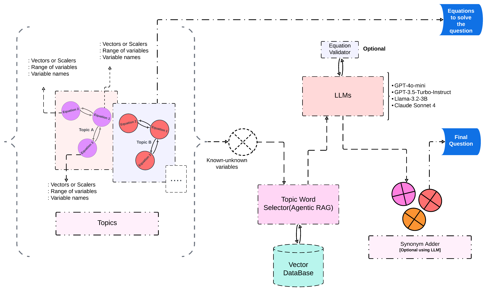

# Agentic Physics Question Generator

Generating high-quality Physics Word Problems (PWPs) that exhibit complexity, novelty, and enhanced solvability represents a significant, yet under-researched, challenge in educational and AI-driven content generation. Existing methodologies, including those adapted from the more explored domain of Math Word Problems (MWPs), frequently fail to produce robust content. Specifically, these approaches often result in problems that are mathematically ill-posed (unsolvable or ambiguous), overly simplistic in structure, or constrained by limited linguistic and conceptual diversity. In this paper, we introduce a novel, two-stage generative framework designed to overcome these fundamental limitations The core of our innovation is a systematic equation-chaining methodology that programmatically links multiple valid physics equations and an agentic RAG framework that dynamically selects topic words for a physics word problem. Our approach also facilitates fine-grained control over problem difficulty. In the second stage, we leverage the power of Large Language Models (LLMs) to translate this deterministic structure into a coherent and fluent natural language question. By using the equation chain and topic words as an explicit, constrained prompt, we guide the LLM to maximize linguistic diversity and contextual realism while retaining the guaranteed mathematical correctness. Through rigorous human and automated evaluations, we demonstrate that our framework achieves significant improvements across several key metrics. Our generated PWPs show a marked increase in complexity (requiring more conceptual steps), novelty (moving beyond standard textbook templates), and correctness (enhanced solvability guarantees). This work establishes our method as a reliable and promising tool for automatically creating diverse and challenging physics content suitable for both educational resource development and advanced research in symbolic reasoning.

## Architecture

The architecture diagram is available in `src/`:



At a high level, the pipeline is:
1. The user picks a topic and then the algorithm selects known/unknown variables and equations for the physics question.
2. The algorithms runs iterative retrieval from Qdrant (`RagAgent`) to build topic context.
3. Prompt the selected LLM to generate a physics question given topic context and equations.
4. Validate and repair question format/solvability using a LangGraph trusted-editing agent (`TEditAgent`).
5. Optionally persist outputs to CSV under `DATASET/`.
6. The generated question is judged, the feedback is used to train an RL algorithm which selects better topic equations so that the LLM can generate better physics questions next time. 

## Repository Layout

- `main.py`: CLI entrypoint for generation.
- `config.yaml`: Topic selection, output paths, trial count, and train/output switches.
- `TOPICS/`: Topic equation graphs and variable metadata JSON files.
- `LLM/`: LLM adapters to run different models.
- `LLM_CONFIG/config.json`: API keys and model configuration.
- `UTILS/rag_agent.py`: Agentic retrieval workflow.
- `UTILS/rag_db.py`: Qdrant collection management and similarity retrieval.
- `UTILS/trusted_editing.py`: Format + solvability validation graph.
- `DATASET/questions_v1` and `DATASET/questions_v2`: Generated datasets.

## Requirements

- Python `>=3.12`
- Dependencies listed in `pyproject.toml`
- At least one valid LLM provider key (OpenAI or Anthropic) in `LLM_CONFIG/config.json`

## Setup

1. Create and activate a Python environment.
2. Install dependencies from `pyproject.toml` using your preferred tool (`uv`, `pip`, or Poetry).
3. Open `LLM_CONFIG/config.json` and set real values for:
    - `OPENAI_API_KEY` and/or `ANTHROPIC_API_KEY`
    - optional tracing/token values if needed
4. Select the runtime model in `LLM_CONFIG/config.json`:
    - `LLM_MODEL.MAIN_MODEL` (for example, `llm_OpenAI` or `llm_Anthropic`)
    - `LLM_MODEL.INNER_MODEL` (for example, `gpt-4o-mini` or `claude-haiku-4-5-20251001`)

## Configure Topics and Output

Edit `config.yaml`:
- `Topics`: available topic menu in CLI.
- `Input.TopicsDir`: topic JSON location, this is also the location where the RL model is saved.s
- `Input.LLMConfig`: model/key config file.
- `Output.Dir`: target output directory (for example `DATASET`).
- `Output.BUILD`: set to `1` to save generated questions.
- `Train`: set non-zero to enable reward feedback for equation graph training.

## Run

```bash
python main.py
```

The script prints a numbered topic menu and asks for a topic index.

## Data and Retrieval Notes

- Topic collections used by default include `env_sm`, `env_np`, `env_g`, and `env_elec`.
- Qdrant uses local persistence at `QdrantDB/`.
- Source PDFs for collection building are loaded from `RAW_TEXT/<collection_name>*.pdf`.

## Development Notes

- Pytest configuration is available in `pytest.ini`.
- A sample utility test exists at `UTILS/test/test_graph_chain.py`.
- Notebooks for experimentation and GPT-2 fine-tuning are under `QueryGPT2.ipynb` and `FINE_TUNE_GPT2/`.

## Screenshots

Additional visuals are in `src/`:
- `src/config.png`
- `src/terminal1.png`
- `src/terminal2.png`

## Acknowledgment

If you use this codebase in research or coursework, please cite or acknowledge the project.
